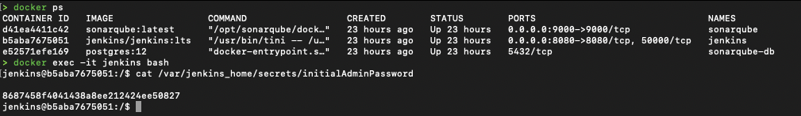

# Using SonarQube and Jenkins for Node.js Application Code Analysis

This is a short tutorial on integrating `Jenkins` and `SonarQube` locally, from Code Analysis of `NodeJs` Apps utilizing `Docker compose`.

- [Docker](https://www.docker.com)
- [Any Git Repository](https://github.com/navaid7890/insta-clone.git) (github for example)

```yaml 
version: "3.5"

services:
  jenkins:
    image: jenkins/jenkins:lts
    container_name: jenkins
    restart: always
    ports:
      - "8080:8080"
    volumes:
      - jenkins_home:/var/jenkins_home
    networks:
      - my-network

  sonarqube:
    image: sonarqube:latest
    container_name: sonarqube
    restart: always
    ports:
      - "9000:9000"
    networks:
      - my-network
    environment:
      - sonar.jdbc.url=jdbc:postgresql://sonarqube-db:5432/sonar
      - sonar.jdbc.username=sonar
      - sonar.jdbc.password=sonar
    volumes:
      - sonarqube_data:/opt/sonarqube/data
      - sonarqube_extensions:/opt/sonarqube/extensions
      - sonarqube_logs:/opt/sonarqube/logs
    depends_on:
      - sonarqube-db

  sonarqube-db:
    image: postgres:12
    container_name: sonarqube-db
    restart: always
    networks:
      - my-network
    environment:
      - POSTGRES_USER=sonar
      - POSTGRES_PASSWORD=sonar
    volumes:
      - sonarqube_db:/var/lib/postgresql
      - sonarqube_db_data:/var/lib/postgresql/data

volumes:
  jenkins_home:
  sonarqube_data:
  sonarqube_extensions:
  sonarqube_logs:
  sonarqube_db:
  sonarqube_db_data:

networks:
  my-network:
    driver: bridge

```


## This docker-compose.yml file defines a Docker Compose configuration for orchestrating multiple containers. It specifies three services (jenkins, sonarqube, and sonarqube-db), volumes, and a network.

### Let's break down the technical details:

### Docker Compose Version:
version: "3.5": Specifies the version of the Docker Compose file format.

# Services:

## Jenkins Service (jenkins):

### image: jenkins/jenkins:lts: 
Specifies the Docker image for the Jenkins service, using the Long Term Support (LTS) version.

### container_name: jenkins
Assigns a custom name to the Jenkins container.

### restart: always 
Configures the container to restart automatically.

### ports: - "8080:8080" 
Maps port 8080 on the host to port 8080 in the Jenkins container.

### volumes: - jenkins_home:/var/jenkins_home 
Mounts a volume for Jenkins data.

### networks: - my-network
Connects the container to the custom network named my-network.

## SonarQube Service (sonarqube):

### image: sonarqube:latest
Specifies the Docker image for the SonarQube service, using the latest version.

### container_name: sonarqube
Assigns a custom name to the SonarQube container.

### restart: always
Configures the container to restart automatically.

### ports: - "9000:9000"
Maps port 9000 on the host to port 9000 in the SonarQube container.

### networks: - my-network
Connects the container to the custom network named my-network.

### environment: 
Sets environment variables for SonarQube, including database connection details.

### volumes:
Mounts volumes for SonarQube data, extensions, and logs.

### depends_on: - sonarqube-db
Specifies that the sonarqube service depends on the sonarqube-db service.

## SonarQube Database Service (sonarqube-db):

### image: postgres:12
Specifies the Docker image for the PostgreSQL database, using version 12.

### container_name: sonarqube-db
Assigns a custom name to the SonarQube database container.

### restart: always
Configures the container to restart automatically.

### networks: - my-network
Connects the container to the custom network named my-network.

### environment:
Sets environment variables for PostgreSQL, including the username and password.

### volumes:
Mounts volumes for PostgreSQL data.

### Volumes:
Defines six named volumes (jenkins_home, sonarqube_data, sonarqube_extensions, sonarqube_logs, sonarqube_db, sonarqube_db_data) that are used by the services to persist data.

### Networks:
Defines a custom bridge network named my-network for connecting the services.

### Build and run docker-compose file.
```bash
docker compose up --build -d
```
### Build & Run

### Docker Images


### Containers


## Jenkins Setup
- [http://localhost:8080/](http://localhost:8080/) visit `Jenkins` on your browser

You need `initialAdminPassword` to proceed, this can be found inside jenkins docker contianer.
```bash
docker ps
docker exec -it jenkins bash
cat /var/jenkins_home/secrets/initialAdminPassword
```


Click on `Install suggested plugins`


Create Jenkins User (this user will be use to login)


Setup Jenkins Url


Start Using Jenkins


# Install Plugins
- Click on `Manage Jenkins`
- Click on `Plugins`
- Click on `Available Plugins`


Now install search and install the following plugins `SonarQube Scanner`, `NodeJs`


Scroll down and click restart server
Relogin with the user you created in above steps.

## SonarQube Setup
- [http://localhost:9000/](http://localhost:9000/) visit `SonarQube` on your browser

Use default credentials 
**login: `admin`**
**password: `admin`**


Now Update Password


## Plugins Configuration

### System, SonarQube
Now, Let's configure `SonarQube` and `NodeJs` Plugin
- Click on `Manage Jenkins`
- Click on `System`
- Scroll down and click on `Add SonarQube`


The Server URL will be http://sonarqube:9000. Then click to save on bottom (`sonarqube` is the name of service from docker-compose file which is being used in the URL)


### Tool, SonarQube Scanner
- Click on `Manage Jenkins`
- Click on `Tools`
- Scroll down and click on `Add SonarQube Scanner`

Enter the name `SonarQubeScanner`


### Tool, NodeJs
- Click on `Manage Jenkins`
- Click on `Tools`
- Scroll down and click on `Add nodejs`

Enter the name `nodejs`


## Configure Jenkins Webhook in Sonarqube
In your SonarQube [http://localhost:9000/](http://localhost:9000/), go to Administration > Configuration > Webhooks


The Name is Jenkins and the URL is http://jenkins:8080/sonarqube-webhook/


## Add SonarQube Properties
Add Sonarqube properties to the root directory of your application, which you are going to scan.

### Sonarqube Access Token
Generate access token for `Jenkins` to access `Sonarqube`

Open SonarQube [http://localhost:9000/](http://localhost:9000/)

Click on your user profile, and select My account.
- Click on `Profile Icon`
- Click on `My Account`


Copy the generate secret

### Add Token on Jenkins
Go to Manage Jenkins > Configure system
- Click on `Manage Jenkins`
- Click on `System`
- Scroll down to the `SonarQube Plugin Configuration` you configured in above steps and click on `Add` under `Server Authentication Token`


Select `Kind` as a `Secret Text` from drop down and enter the copied token.


Now select `sonarqube-access-token` under `Server Authentication Token`

## Create Jenkins Job
Go to Dashboard
- Click on `New Item`
- Click on `Pipeline`


Scroll down and paste the following script.

```
pipeline {
    agent any
    
    tools {nodejs "nodejs"}

    stages {
        stage('Clone Repository') {
            steps {
                git branch: 'main', url: 'https://github.com/navaid7890/insta-clone.git'
            }
        }
    
        stage('SonarQube Scanning') {
            environment {
                SCANNER_HOME = tool 'SonarQubeScanner';    
            }
            
            steps {
                
                withSonarQubeEnv('SonarQube') {
                    sh "${SCANNER_HOME}/bin/sonar-scanner"
                }
            }
        }
    }
}
```


Click on `Build Now` and wait for pipeline to complete.


Once completed go to URL [http://localhost:9000/dashboard?id=instal-clone](http://localhost:9000/dashboard?id=instal-clone), `insta-clone` is the value you defined in the project root sonarqube properties.

